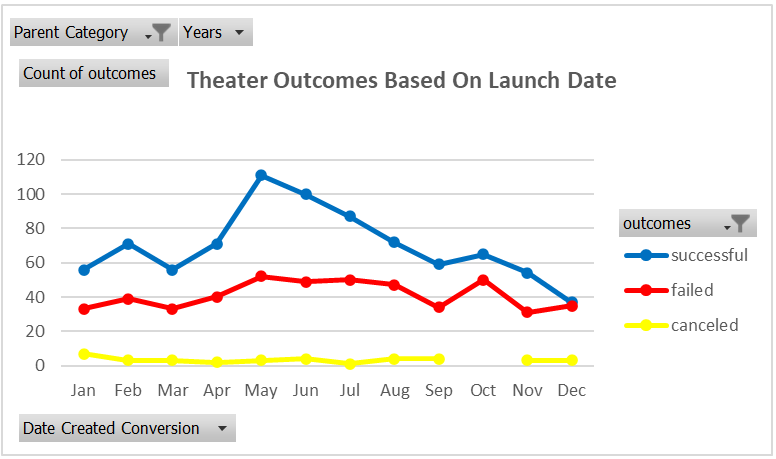

# kickstarter-analysis

## Deliverable 1 - Outcomes Based On Launch Date
### Overview of Project
The purpose of creating the piviot table and pivot chart geared for theater outcomes based on launch date, was to illustrate to Louise the success rate of any given project based on launch date. Louise had created a kickstarter herself and wanted to see how other projects faired compared to her own.
### Analysis and Challenges

During the analysis of the launch date the pivot chart was created from the pivot table. It is key to make sure the data in the table is correctly typed and filtered in order for the chart to show the true picture of the data. If the data was filtered or entered inccorectly a trend could be spoted that is not actually provided by the data
### Results
Based off of our findings and the chart above, not only do overall projects increase in the month of May, however the successful projects increase realitive to failed and canceled projects as well. This tells us that the success rate of projects peaks in may and dives during the winter months. A conclusion that could be drawn from this data is, customers could have more disposable income in the months furthest away from the holidays. During the holidays, expenses tend to increase inturn deacreasing income able to be donated to a kickstarter.
## Deliverable 2 - Outcomes Based On Goal:
### Overview of Project
The purpose of creating this pivot table and chart filtered for play outcomes based on goal, was to display to Louise what the other projects with similar and different goals outcomes were.
### Analysis and Challenges
During the analysis of the outcomes based on goals, it was important to make sure you paid attention to the data that you were working on and maybe more importantly what you had already done. For this table there was a similar formula required for the columns. In order to make sure the data turned out correctly it was important to input the similar data with slight variations each time.
### Results
Based on our finding from the table and chart we created, it was easy to see that the lower the monetary goal the higher the success rate while the higher monetary goal yielded a lower success rate. This was to be expected, as a higher money requirement meant a greater chance of failure. There were two points in which this logic did not hold up on the graph and the only reasoning I can come up with is at some point a higher quality play will need more money.
